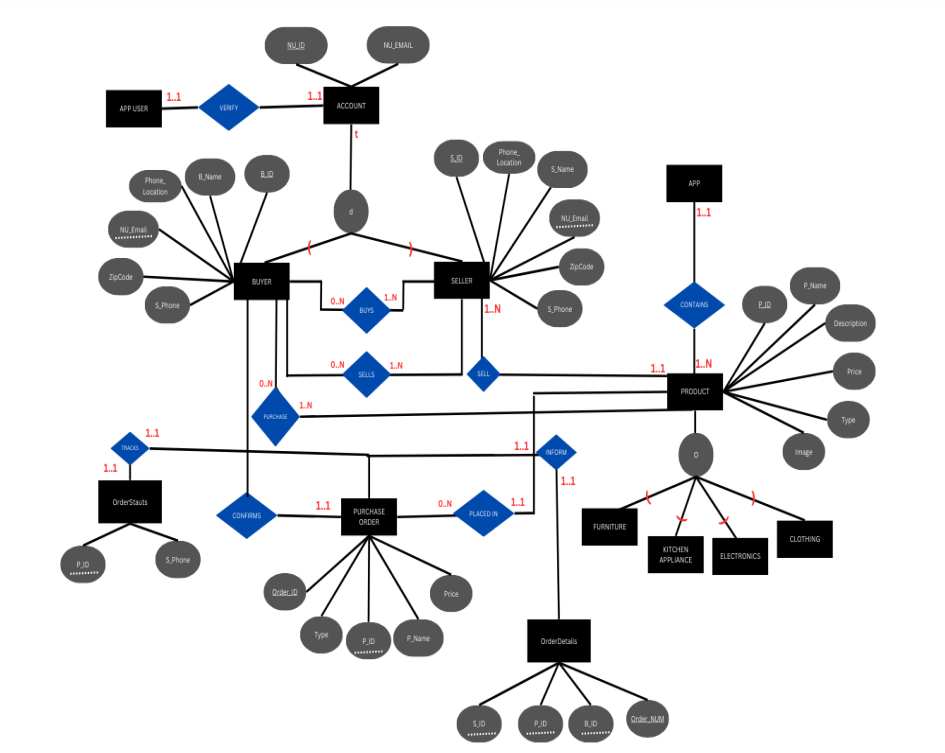
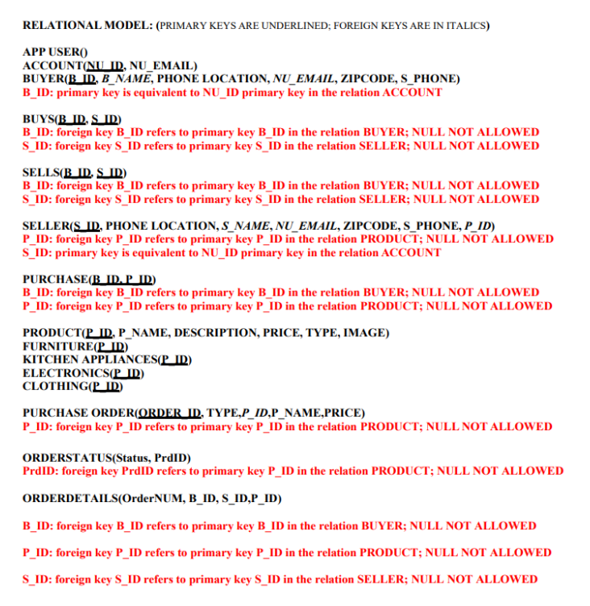
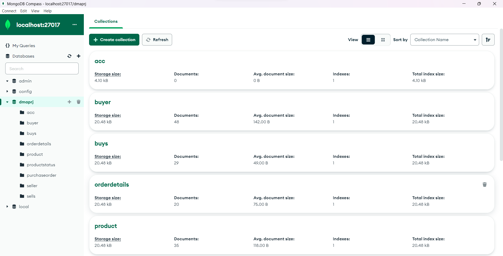
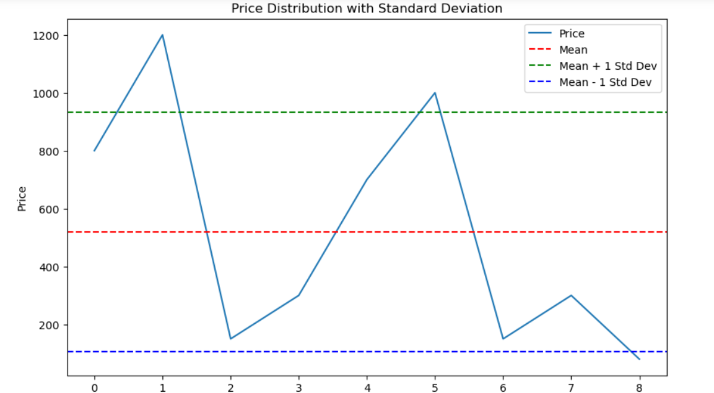
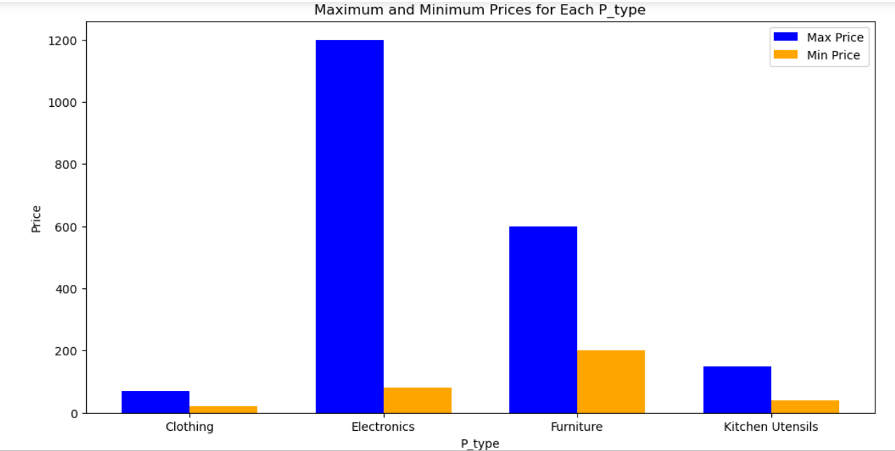
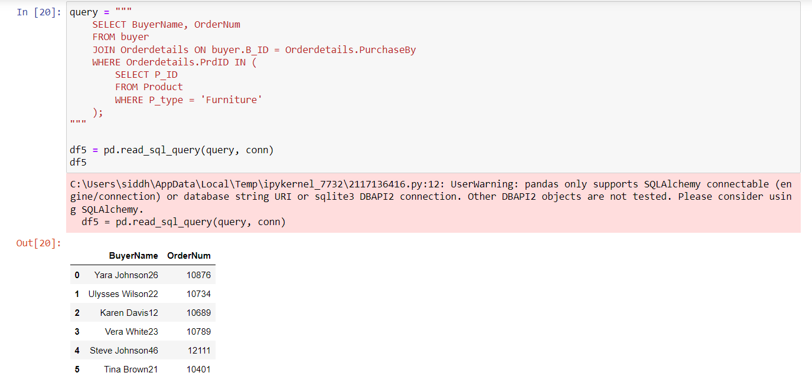

# 📊 Northeastern University Student Shopper Analytics

## 🌐 Overview

This repository contains the comprehensive project on Northeastern University Student Shopper Analytics, addressing the unique challenges faced by students when relocating for education. The application serves as a versatile platform for the exchange of various household products, including furniture, kitchen appliances, and clothing.

### 📈 Database Models & Data Visualization

1. **Extended Entity Relationship Model (EER)**
   
   Showcases specializations in the products table.

2. **Relational Model**
   
   Demonstrates effective normalization of the database.

3. **MongoDB Hosting**
    
   Displays the hosting of tables on MongoDB Compass.

4. **Data Visualization - Standard Deviation**
   
   Connects MYSQL database to Python Jupyter notebook, displaying a line chart showing price distribution with respect to standard deviation.

5. **Product Prices Analysis**
    
   Illustrates maximum and minimum prices of products stored in each category.

6. **Advanced SQL Queries Using Python**
    
   Exhibits advanced SQL queries retrieving buyer numbers and order numbers for those who purchased furniture.

## 🚀 Insights, Recommendations, and Key Conclusions

The primary goal of the Northeastern University Student Shopper Analytics application is to address challenges faced by students during relocation, providing a dedicated marketplace for a wide range of household products. The database is connected to Python, and key information is visualized using various graphs and charts.

### 🌟 Key Benefits

- Decreases reliance on disparate and unsafe platforms like Whatsapp and Facebook groups.
- Enhances the buying and selling experience for Northeastern students.
- Improves the overall student experience with a focus on safety and security.

### 🚀 Recommendations

1. **User-Centric Design:**
   - Prioritize the development of a user-friendly interface to ensure a positive experience for both buyers and sellers.

2. **Mobile Optimization:**
   - Optimize the application for use on mobile phones to cater to the on-the-go lifestyle of students.

3. **Marketing Strategies:**
   - Implement marketing strategies to raise awareness among Northeastern students.

4. **Collaboration:**
   - Collaborate with university departments and student organizations to promote the application.

5. **Regular Updates:**
   - Continuously improve the application based on user feedback to stay up to date with changing needs.

6. **Community Building:**
   - Foster a sense of community within the app by integrating features such as forums or discussion boards for students to share advice and tips related to relocation.

### 🎓 Key Conclusions

The Northeastern University Student Shopper Analytics project draws key conclusions based on the insights gained during its development and analysis:

1. **Enhanced Student Experience:**
   - The application significantly contributes to the overall student experience by addressing the unique challenges of relocating for education.

2. **Safety and Security:**
   - The incorporation of user verification processes using Northeastern IDs and emails mitigates the risks associated with scams and and fraudulent activities, ensuring a trustworthy environment.
     
3. **Efficient Database Management:**
   - The extended entity relationship model (EER) and relational model demonstrate effective database management, providing a solid foundation for the application.

--Author: **Siddhant Sunil Chavan**
